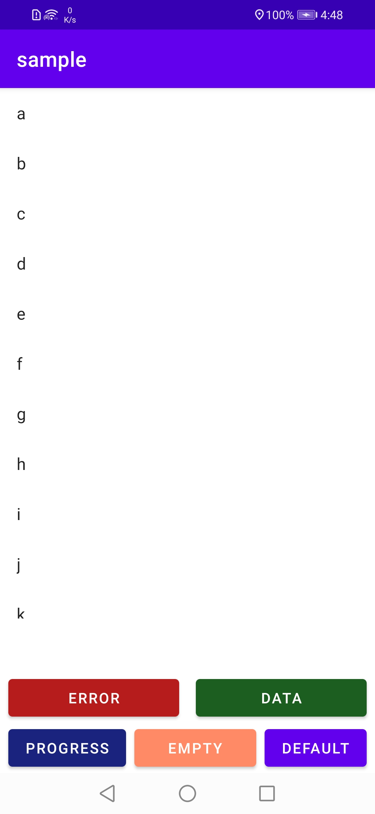

# StatefulRecyclerView
RecyclerView implementation that displays UI component placeholder for differenet states. Loading, Error, Data and Empty

|  |  |
|--|--|
| Data | Error |
|  |   
| Error | Progress |
|  |   |
